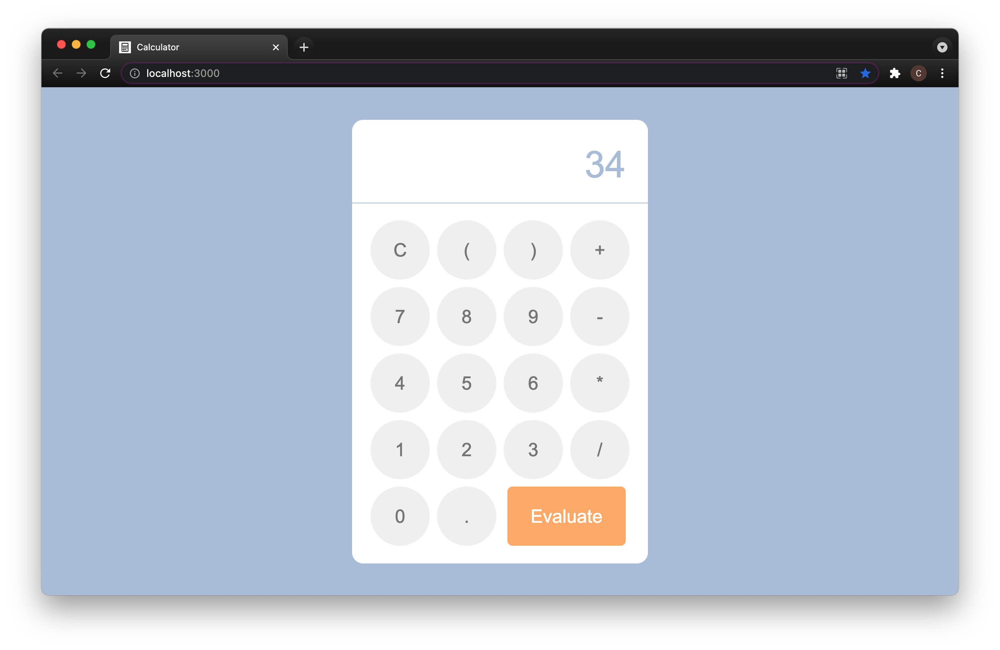

# Calculator

 
 The Calculator app takes a string of input and calculates it without using the built in 'eval' function.
 The evaluate function which handles calculations is broken up into two steps:
 
 The first step is to tokenize the string input provided by the user. A token in this case is an instance of the `Token` class, and it represents one of the different valid values that can be used in a series of math operations (i.e. a '+' value would be represented by a plus-typed token, a '12' value would be an integer-typed token, etc.). 
 
 The second step is to evaluate the tokens produced in the first step. This evaluation process iterates through the tokens and calculates the operations they represent in the correct order (i.e. parentheses resolve before multiplication and division, multiplication and division resolve before addition and subtraction, etc.).
 
 #### Technologies
 `React.js`
 
 ## Installation 
 Clone this repository:\
 `git clone https://github.com/cmillecan/calculator.git`
 
 From the project root directory:
 
 Download dependencies: `npm install`
 
 Run app: `npm run start`
 
 ## Testing
 
 `npm run test`
 

